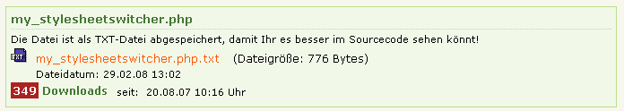
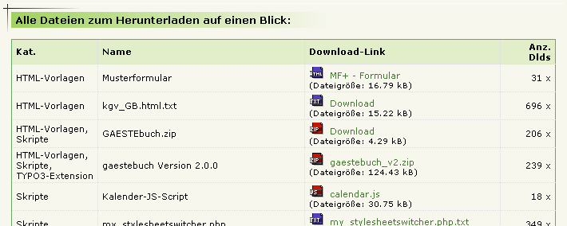

.. include:: ../Includes.txt

.. _introduction:

============
Introduction
============

.. _what-it-does:

What does it do?
================

Download system with many features. Displays downloads with short description, click counter, file size and image
preview. It is possible to create a detail site for each download record.

Credits
=======

From Sebastian: Thanks to Kurt Kunig ( www.kupix.de ) for several add-ons and manual revision.

From Kurt: Thanks to Sebastian Baumann for the initial idea and the source base of version 0.1.2

Screenshots
===========

Standard **without** image preview:

Standard **with** image preview:

.. figure:: ../Images/Screenshots/ScreenshotWithImagePreview.png
   :width: 500px
   :alt: Screenshot with image preview

Complete list of all downloads (no "starting point" selected and "plugin.tx_kkdownloader_pi1.defaultDownloadPid = all"
and a separate html-template selected in the TypoScript Setup):

