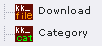
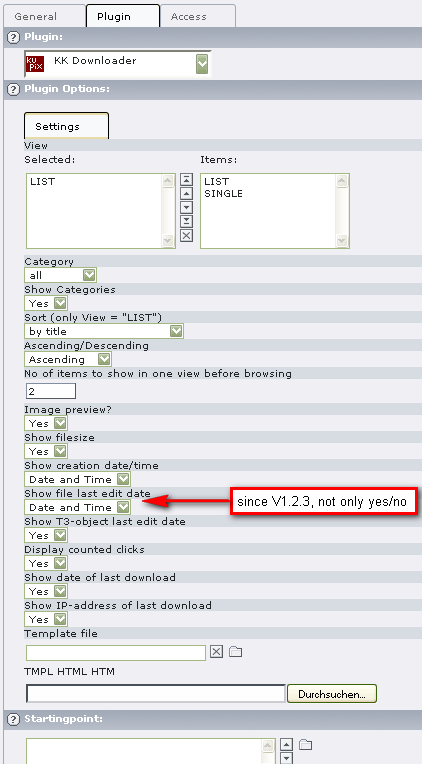
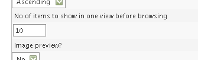
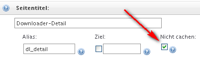

.. include:: ../Includes.txt

.. _user-manual:

============
Users Manual
============

To setup and use the extension, you should do the following:

- Install The Extension
- Create Or Set a Data Folder (Sysfolder, named "download-container" e.g.) and point on himself in the field
   "General Record Storage page"! This is important for finding the categories later on!
   You can also put a download object into a **normal** page instead of a sysfolder; the sysfolder then is only for
   the general categories. Don’t forget to point to that sysfolder from this page in the
   "General Record Storage Page".
- Add Categories and Downloads into this data sysfolder or the downloads into the page where he should be visible.
- Create a new page and add the Extension (and add download items if they are not in a sysfolder)
- Configure the options

Create the sites (data folder, …)
---------------------------------

You have to create several pages. The usual way is to create one sysfolder where the records and categories are
saved in.It´s possible to create the extension records in normal sites but we recommend to use a new Storage
Folder because there can be many records and you can keep everything in one place.

- Create a page where the LIST view appears
- Create a page where the SINGLE view appears (not absolutely needed)
- Create a SYSFOLDER named **download-container** e.g. beyond your site with LIST view.
- On each page you have to set the **General record store page** to your (category-) sysfolder.
- Put the plugin into your page(s) template with **Include static (from extensions) = kk_downloader** and put
   the desired parameters in.
- Set the plugin-configuration into the template setup box.
   You can copy and paste it from this manual if you want (see below)

Add Categories and Partners in the data folder
----------------------------------------------

Click on **Create new record** and choose one of the following:

Category for a new Category and Download for a new Partner Record.
You have to add first your Categories, because you need the Categories to add a new
Partner Record (only in the sb_downloader- version!). Here in this version Categories
are no longer mandatory fields! The form fields are self-explanatory.

Configure the options: LIST View
--------------------------------

After you create a page and add the extension, you have to edit the Flexform to get
the right settings.

Please do not forget to deactivate the cache in the page behaviour!

Flexform options
----------------

New since version 1.2.0: browse max. X items per page

Configure the options: SINGLE View
----------------------------------

The same as above, only choose SINGLE instead of LIST!

A page with the plugin SINGLE view should not be cached! Please set it in the page options.

What you have to look for!
##########################

Tell the plugin the ID of the page with the single view:

You have the possibility to edit the following plugin properties via
setup:plugin.tx_kkdownloader_pi1.singlePID = 28 (e.g.)
Put the marker ###MORE### into your HTML-template {This link will be inactive if a)
the singlePID is not given or has a wrong UID or b) the correct singlePID-page has the
hidden status.
